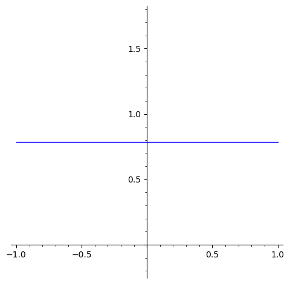
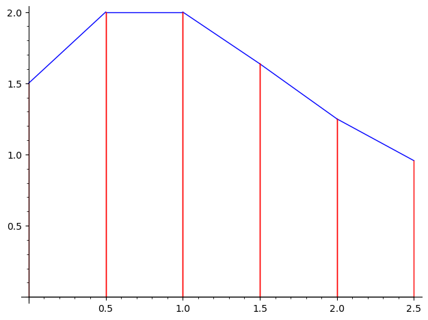

# TP 5 - Intégration

Consignes :

- Le TP doit être réalisé **individuellement** et rendu sur Junia-Learning avant la **fin de la séance**.
- <u>Votre rendu doit impérativement contenir des explications</u>. Les notebooks contenant uniquement des blocs de code sans aucun contexte seront pénalisés.
- Renommer ce fichier **nom-prenom-TP5** , en cliquant sur le titre du fichier "TP 5 - Intégration" en haut à gauche 


Cliquer deux fois sur la cellule pour compléter ci-dessous :

- NOM : paolo
- PRENOM : alexandre

# Intégrales

Supposons que l'on souhaite calculer les primitives de :  $$ \int \frac{1}{2x+1} \mathrm{ d}x  $$


```python
x = var('x')
f = 1/(2*x+1)
integral(f,x)
```


    1/2*log(2*x + 1)


```python
integrate(f,x)
```


    1/2*log(2*x + 1)


Remarques : 

- La machine renvoie une primitive. Pour avoir l'ensemble des primitives, il faut bien entendu ajouter une constante. 
- La fonction log est la fonction logarithme népérien usuel, habituellement notée ln.
- Sage omet les valeurs absolues, ce qui ne l'empêche pas de faire des calculs exacts même pour les valeurs négatives. (Il travaille avec le logarithme complexe).

ou évaluer la même intégrale sur un intervalle donné $[0,1]$ :


```python
integral(f,x,0,1)
```


    1/2*log(3)


ou avoir une approximation de l'intégrale :


```python
N(integral(f,x,0,1))
```


    0.549306144334055


# EXERCICE 1

Calculer les primitives suivantes et vérifier que vous avez trouvé le bon résultat en utilisant la commande `bool`.
  \begin{equation*}
    a) \quad \int \tan t \text{ d} t \quad
    b) \quad \int \dfrac{e^{kt}-e^{-kt}}{e^{kt}+e^{-kt}} \text{ d} t \quad
    c) \quad \int \dfrac{1}{1+e^{3u}} \text{ d} u
  \end{equation*}


```python
var('t') # a
f = tan(t)
integral_f = integrate(f, t)
bool(integral_f == -log(cos(t)))
```


    True


```python
#b
f2 = ( exp(k*t) - exp(-k*t) ) / ( exp(k*t) + exp(-k*t) )
integral_f2 = integrate(f2,t)
bool(integral_f2 == log(e^(k*t) + e^(-k*t))/k)
```


    True


```python
#c
var('u')
f3 = (1)/(1+exp(3*u))
integral_f3 = integrate(f3,t)
bool(integral_f3 == t/(e^(3*u) + 1))
```


    True


# EXERCICE 2

a) Calculer l'intégrale $ \displaystyle \int_0^{1} \sqrt{1-x^2} \text{ d} x  $.


```python
var('x')
f = sqrt(1-x^(2))
intf = integrate(f, x, 0,1)
show(intf)
```


<html>\(\displaystyle \frac{1}{4} \, \pi\)</html>


b) Représenter le graphe de la fonction intégrande en utilisant "aspect_ratio=1". Qu'est-ce que vous remarquez ?


```python
show(plot(intf), aspect_ratio=1)
# ON REMARQUE QUE LA DROITE EST CONSTANTE PARRALLELE AUX ABSICSSES
```


    

    


# Rappels : boucles et fonctions

La syntaxe de Sage est basée sur celle du langage Python.
L'indentation du code joue un rôle important dans cette syntaxe : le nombre d'espaces au début de chaque ligne a une influence sur la manière dont le code sera interprété.

Les boucles sont implémentées avec les constructuers `while`

C’est par l’indentation que l’on délimite le bloc exécuté dans la boucle while.


```python
i=0
while i<= 2:
    i=i+1
i

```


    3


et `for`

Pour la boucle  `for`  on peut utiliser l'instruction  `range(n)`  qui renvoit la liste des  $n$  premiers entiers (indexé à partir de  0 ). On a donc  `range(n)=[0..n−1]`.


```python
n = 3
show(range(n))
for i in range(n):
    print(i)
```


<html>\(\displaystyle \verb|range(0,|\verb| |\verb|3)|\)</html>


    0
    1
    2


Pour l'instruction  `range`  on peut spécifier un autre indice de départ, un autre indice de fin ainsi que le pas. De même, pour l'instruction  .. .


```python
show(range(0,11,2))
show(range(5,1,-1))
show([0..11,step=2])
show([5..1,step=-1])
```


<html>\(\displaystyle \verb|range(0,|\verb| |\verb|11,|\verb| |\verb|2)|\)</html>


<html>\(\displaystyle \verb|range(5,|\verb| |\verb|1,|\verb| |\verb|-1)|\)</html>


<html>\(\displaystyle \left[0, 2, 4, 6, 8, 10\right]\)</html>


<html>\(\displaystyle \left[5, 4, 3, 2, 1\right]\)</html>


Cependant on peut faire parcourir à l'indice n'importe quelle liste donnée dans l'instruction (sans que cette liste soit spécifiquement à valeurs entières ni même tous du même type).


```python
TableauTest = ['t','e','s','t', 2+2]
for i in TableauTest:
    print(i)
```

    t
    e
    s
    t
    4


L'utilisation de boucles  `for`  est très utile pour travailler avec les listes.


```python
# Création d'une liste de 0 de taille 5
L = [0 for j in range(5)]
show(L)
# Parcours d'une liste de couples et récupération de la liste des premières composantes de chaque couple
L2 = [(0,1),(2,3),(4,5),(6,7)]
show('Liste complète ' , L2)
L2extrait = [l[0] for l in L2]
show('Liste extraite ' , L2extrait)

```


<html>\(\displaystyle \left[0, 0, 0, 0, 0\right]\)</html>


<html>\(\displaystyle \verb|Liste|\verb| |\verb|complète| \left[\left(0, 1\right), \left(2, 3\right), \left(4, 5\right), \left(6, 7\right)\right]\)</html>


<html>\(\displaystyle \verb|Liste|\verb| |\verb|extraite| \left[0, 2, 4, 6\right]\)</html>


Pour définir la fonction $f(x)=0$ si $x<0$ et $f(x)=x^2$ si $x\geq0$ , on peut faire par exemple :


```python
def f(x):
    if x<0:
        return 0
    else:
        return x^2
```


```python
f(5)
```


    25


```python
f(-5)
```


    0


Une fonction est récursive si elle s’appelle elle-même.


```python
def puissance(x,n) :
    if n>0 :
        return x * puissance(x, n-1)
    else : return 1
```


```python
puissance(2,5)
```


    32


# Intégration numérique

Le but est d’aborder le calcul général de l’intégrale d’une fonction $f(x)$ sur un domaine
fini délimité par des bornes finies $a$ et $b$  : $$ I = \int_a^b f(x) \mathrm{ d}x  $$

Dans certains cas très limités, une telle intégrale peut être calculée analytiquement (à la main). Cependant,
ce n’est que très rarement possible, et le plus souvent un des cas suivants se présente :
    
 – Le calcul analytique est long, compliqué et rébarbatif.
    
 – Le résultat de l’intégrale est une fonction compliquée qui fait appel à d’autres fonctions elles-même
longues à évaluer.

 – Cette intégrale n’a pas d’expression analytique (par exemple la fonction erreur : $Erf(x) = \frac{2}{ \pi} \int_0^x e^{-x^{'2}} \mathrm{ d}x'$.
 
Dans tous ces cas, on préfèrera calculer numériquement la valeur de l’intégrale $I$.

L’idée principale est de trouver des méthodes qui permettent de calculer rapidement une valeur approchée de l’intégrale à calculer : $$\tilde{I} \approx I$$

Une méthode bien connue consiste par exemple à diviser l’aire
sous la courbe en un grand nombre de petits rectangles d’aire $\tilde{I_k}$ et de les sommer. 

Le résultat $$\tilde{I}=\sum_k \tilde{I_k} $$ est alors une approximation de l’intégrale $I$. Cette approximation est d’autant meilleure que la largeur $h$ des
rectangles tend vers 0, c’est à dire : $\lim_{h \rightarrow 0}  \tilde{I_k} = I$.

Pour toutes les méthodes que l'on considère, l’intégrale numérique est calculée à
partir de l’évaluation de la fonction $f(x)$ en un nombre de points $n+1$ distincts : $f_k = f(x_k)$, $k\in [0, n]$.

Exemple graphique :

</img>

# Méthodes de quadrature numérique simples:

- Rectangle : $\tilde{I} = (b-a)f(a) \quad $ ou Point au milieu : $\tilde{I} = (b-a)f\bigg(\dfrac{a+b}{2}\bigg)$ 
- Trapèze : $\tilde{I} = (b-a)\dfrac{f(a)+f(b)}{2}$
- Simpson : $\tilde{I} = \dfrac{b-a}{6}[f(a)+4f\bigg(\dfrac{a+b}{2}\bigg)+f(b)]$


# Méthodes de quadrature numérique composites 

L’idée est donc de découper le domaine total d’intégration $[a, b]$ en $n$ intervalles. On approxime alors
l’aire $\tilde{I}_k$, $k \in [0,n−1]$ de chaque intervalle par des méthodes de quadrature numérique simples, et on en déduit une approximation de l’aire totale par une simple somme :

$$\tilde{I}=\sum_k^{n-1} \tilde{I_k} $$

Lorsque $n$ est suffisamment grand, la largeur $h=(b − a)/n$ des intervalles devient aussi petite que l’on veut.

- Rectangles : $$\tilde{I} = \dfrac{b-a}{n} \sum_{i=0}^{n-1}f(x_i)$$

- Trapèzes : $$\tilde{I} = \dfrac{b-a}{n}\bigg(\dfrac{f(a)+f(b)}{2} + \sum_{i=1}^{n-1}f(x_i)\bigg)$$

- Simpson : $$\tilde{I} = \dfrac{b-a}{6n}\bigg(f(a)+2\sum_{i=1}^{n-1}f(x_{i})+4\sum_{i=0}^{n-1}f(m_{i})+f(b)\bigg)$$
avec $m_i = a + (i + \frac 1 2) h$ les milieux des segments $[x_i, x_{i+1}]$.


# EXERCICE 3

On veut estimer $\displaystyle \int_0^\frac{5}{2} f(x) \mathrm{ d}x  $ à partir des données suivantes :

</img>

a) En utilisant la méthode des rectangles. 


```python
x = [0, 1/2, 1, 3/2, 2, 5/2]
f = [3/2, 2, 2, 1.6364, 1.25, 0.9565]
n = 6
h = (5/2 - 0) / n
inte = h * sum(f[i] for i in range(len(f) - 1))
inte
```


    3.49433333333333


b) En utilisant la méthode des trapèzes.


```python
x = [0, 1/2, 1, 3/2, 2, 5/2]
f = [3/2, 2, 2, 1.6364, 1.25, 0.9565]
n = 6
h = (5/2 - 0) / n
integrale_trapezes = (h / 2) * (f[0] + 2 * sum(f[i] for i in range(1, len(f) - 1)) + f[-1])
integrale_trapezes

```


    3.38110416666667


c) Répresenter graphiquement la méthode des rectangles.

Suggestion :
1) Définir un graphique avec la commande `g = Graphics();`
2) Utiliser `line` et ajouter chaque ligne au graphique : `g += line([(1,0) , (1,2)]) `


```python

x = [0, 1/2, 1, 3/2, 2, 5/2]
f = [3/2, 2, 2, 1.6364, 1.25, 0.9565]

g = Graphics()


for i in range(len(x) - 1):
    g += line([(x[i], f[i]), (x[i+1], f[i+1])], color='blue')  
    g += line([(x[i], 0), (x[i], f[i])], color='red')         
    g += line([(x[i+1], 0), (x[i+1], f[i+1])], color='red')  

g += line([(x[0], 0), (x[-1], 0)], color='black')

g.show()

```


    

    


# EXERCICE 4

a) Définir une fonction `trapezes(f,a,b,n)` qui prend en entrée la fonction, les bornes de l'intégrale et le nombre de subdivisions. Elle renvoie en sortie la valeur approchée de l'intégrale selon la <i>méthode des trapèzes</i> et la <i>repésentation graphique de la méthode et de la fonction si $n<15$</i> (Voir l'"exemple graphique" dans l'introduction Intégration numérique)


```python

x = [0, 1/2, 1, 3/2, 2, 5/2]
f = [3/2, 2, 2, 1.6364, 1.25, 0.9565]

g = Graphics()


for i in range(len(x) - 1):
    g += line([(x[i], f[i]), (x[i+1], f[i+1])], color='blue')  
    g += line([(x[i], 0), (x[i], f[i])], color='red')         
    g += line([(x[i+1], 0), (x[i+1], f[i+1])], color='red')   

g += line([(x[0], 0), (x[-1], 0)], color='black')

g.show()

```


    

    


b) En utilisant votre fonction `trapezes(f,a,b,n)`, calculer $\displaystyle \int_1^2 \dfrac{1}{\sin(x)} e^{x^{2}} \mathrm{ d}x  $
et vérifier que ce résultat s'approche de sa valeur exacte.


```python

```

# Curiosité : Performances

La performance d’une méthode se juge en comparant :

- Précision du résultat 

  Celle-ci se caractérise en estimant l’erreur $\varepsilon$ entre l’approximation et la valeur réelle de l’intégrale :

$$\varepsilon = I - \tilde{I}$$ 
  La valeur de l’erreur ne peut pas être calculée exactement puisqu’en général, on ne connaît pas l’intégrale $I$ que l’on cherche à calculer.   Cependant, une majoration peut souvent être estimée en étudiant le développement en série de Taylor de la fonction $f(x)$ (prochain chapitre du cours).


- Rapidité d’exécution nécessaire pour atteindre ce résultat. 

   De manière générale, toutes les méthodes peuvent atteindre de très grandes précisions. Cependant, le temps de calcul augmente avec la précision.
   Ce temps n’augmente pas de la même manière pour toutes les méthodes si bien que certaines
   s’avèrent plus efficaces que d’autres. En particulier, le temps de calcul des méthodes de quadrature est
   proportionnel au nombre de points où la fonction $f(x)$ est évaluée.


```python

```
